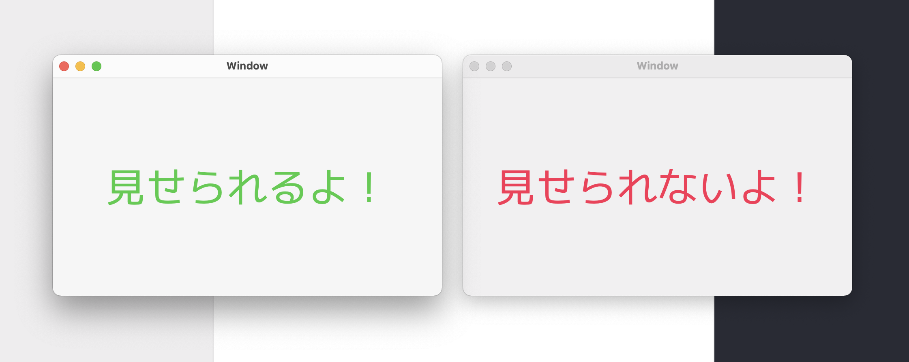

# WindowSharingMode
The sample code of NSWindow that does not appear on the external output.

More details: [NSWindow.sharingType](https://developer.apple.com/documentation/appkit/nswindow/1419729-sharingtype)

User screen image:

Output image (e.g. Screenshot):
The window on the right will not be drawn in the screenshot.

